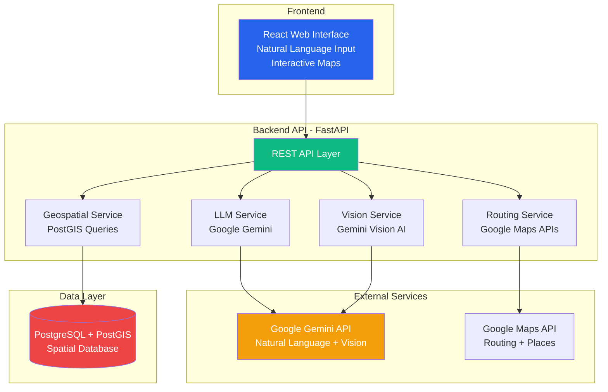
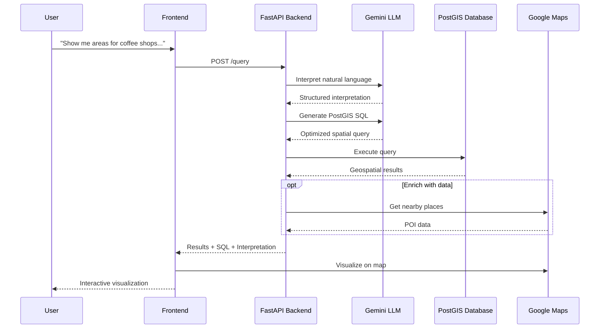
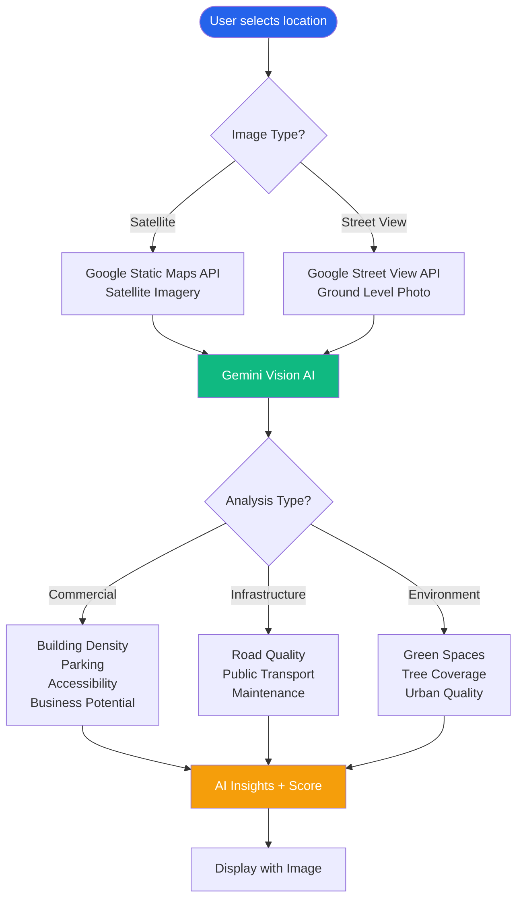
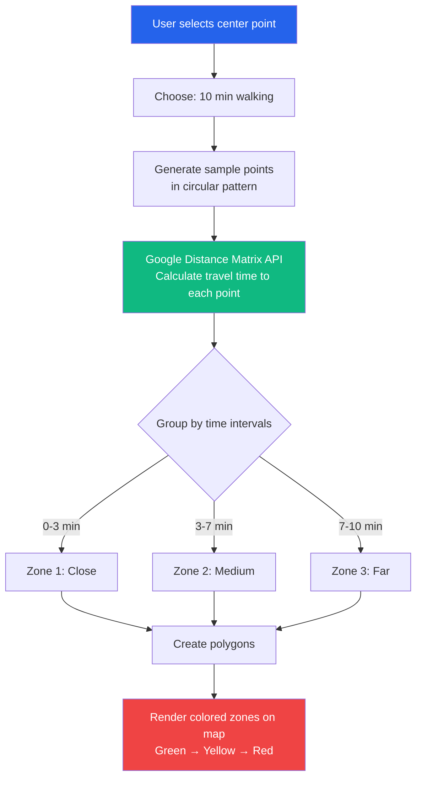

# 🗺️ GeoMindIA

**A powerful platform combining Large Language Models (LLMs) with geospatial data analysis, providing a natural language interface for complex spatial insights with AI vision and route optimization.**

*Intelligent geospatial analysis powered by AI*

[](https://python.org)
[](https://reactjs.org)
[](https://fastapi.tiangolo.com)
[](https://postgis.net)
[](LICENSE)

---

## 🌟 What is this?

This platform transforms how we interact with geospatial data by combining:

- 💬 **Natural Language Queries** - Ask questions in plain English, get spatial insights
- 👁️ **AI Vision Analysis** - Analyze satellite and street view imagery with Gemini Vision
- 🚗 **Route Optimization** - Calculate isochrone maps, optimize multi-point routes, analyze accessibility
- 🗺️ **Dynamic Visualization** - Interactive maps with real-time data rendering
- 🤖 **AI-Powered Intelligence** - Google Gemini interprets queries and generates spatial SQL

### Real Example

**You ask:**
> "Show me areas in Porto Alegre with high potential for coffee shops, considering young population density, no competitors within 500 meters, and within 10 minutes walk from business centers."

**The system:**
1. 🤖 **Gemini AI** interprets your natural language
2. 🔍 Generates optimized **PostGIS SQL** query
3. 📊 Executes complex **spatial analysis**
4. 🗺️ Visualizes results on **interactive map**
5. 📝 Explains the **interpretation and query**

---

## ✨ Key Features

### 1. 💬 Natural Language Geospatial Queries

Ask complex questions in plain English:
- "Find undervalued neighborhoods likely to gentrify in 2 years"
- "Identify food deserts that need grocery stores"
- "Compare best 3 cities in Brazil for tech coworking spaces"

### 2. 👁️ Multi-Modal AI Vision Analysis

Analyze locations using satellite and street view imagery:
- **Commercial Potential** - Evaluate business viability from aerial view
- **Infrastructure Quality** - Assess roads, parking, accessibility
- **Storefront Analysis** - Analyze building facades and foot traffic indicators
- **Environmental Factors** - Green spaces, tree coverage, urban density

### 3. 🚗 Advanced Routing & Accessibility

Sophisticated spatial analysis tools:
- **Isochrone Maps** - Show areas reachable within X minutes (walking/driving/transit)
- **Accessibility Scoring** - Evaluate proximity to hospitals, schools, transit
- **Route Optimization** - Find optimal paths visiting multiple locations
- **Meeting Point Finder** - Calculate best location for distributed teams

### 4. 📊 Powerful Spatial Analysis

PostGIS-powered geospatial operations:
- Proximity searches (`ST_DWithin`)
- Buffer zones (`ST_Buffer`)
- Spatial intersections (`ST_Intersects`)
- Distance calculations (`ST_Distance`)
- Complex multi-criteria analysis

### 5. 📸 Photo Analysis & Location Identification

Upload any photo and let AI identify the location:
- **"Where is this?"** - AI identifies city, neighborhood, and characteristics
- **Property Value Estimation** - Get price estimates from photos
- **Similar Places Finder** - Find locations with similar features
- **Urban Features Analysis** - Identify architectural style, infrastructure, density

### 6. 🎬 Time Travel - Historical Evolution

See how locations changed over time:
- **Historical Satellite Imagery** - Compare multiple years side-by-side
- **Change Detection** - Identify urban growth, deforestation, new construction
- **Growth Rate Analysis** - Quantify development pace
- **Future Predictions** - Project trends based on historical data

### 7. 🎲 What-If Simulator

Simulate urban changes and predict impacts:
- **New Metro Station** - Impact on property values, traffic, accessibility
- **Shopping Mall Development** - Effects on local commerce, foot traffic, real estate
- **Population Growth** - Infrastructure stress, service demand, housing needs
- **New Park** - Environmental benefits, property value impact, quality of life
- **Commercial Zones** - Business potential, traffic patterns, zoning compatibility

### 8. 🌐 Multi-City Comparison

Compare multiple cities automatically for business potential:
- **Parallel Analysis** - Analyze dozens of cities simultaneously
- **Ranked Results** - Cities scored and ranked by business viability
- **Demographic Comparison** - Population, income, GDP, growth rates
- **Market Saturation** - Competition levels, opportunity areas
- **Custom Criteria** - Tailor analysis to specific business types

---

## 🏗️ System Architecture



---

## 🚀 Quick Start

### Prerequisites

- Python 3.10+
- Node.js 18+ (for React frontend)
- PostgreSQL 14+ with PostGIS extension
- Google Gemini API key
- Google Maps API key

### 1. Clone the Repository

```bash
git clone <repository-url>
cd TESTSS
```

### 2. Set Up Backend

```bash
# Create virtual environment
cd backend
python3 -m venv venv
source venv/bin/activate  # Windows: venv\Scripts\activate

# Install dependencies
pip install -r ../requirements.txt
```

### 3. Configure Database

```bash
# Create database
createdb geospatial_ai

# Initialize with PostGIS and sample data
psql geospatial_ai < database/init.sql
```

### 4. Set Up Environment Variables

```bash
# Copy example file
cp env.example .env

# Edit .env with your API keys
# GEMINI_API_KEY=your_gemini_api_key
# GOOGLE_MAPS_API_KEY=your_maps_api_key
```

### 5. Start the Backend

```bash
cd backend
python main.py
```

Backend runs on `http://localhost:8000`

### 6. Start the Frontend

**Option 1: React Frontend (Recommended)**

```bash
cd frontend-react
npm install
cp .env.example .env
# Edit .env and add VITE_GOOGLE_MAPS_API_KEY
npm run dev
```

Frontend runs on `http://localhost:3000`

**Option 2: Vanilla JS Frontend**

```bash
cd frontend
python -m http.server 3000
```

### 7. Open Your Browser

Navigate to `http://localhost:3000` and start exploring! 🎉

---

## 📊 System Flow Diagrams

### Natural Language Query Flow



### AI Vision Analysis Flow



### Isochrone Map Calculation



---

## 🎯 Use Cases

### Business Intelligence
- **Retail Location Planning** - Find optimal locations for new stores
- **Market Analysis** - Identify underserved markets
- **Competitor Analysis** - Map competitive landscape
- **Foot Traffic Analysis** - Predict customer flow

### Urban Planning
- **Service Coverage** - Identify gaps in public services
- **Accessibility Analysis** - Evaluate transit accessibility
- **Green Space Planning** - Find areas lacking parks
- **Infrastructure Assessment** - Evaluate road and utility coverage

### Real Estate
- **Investment Opportunities** - Find emerging neighborhoods
- **Property Valuation** - Assess location factors
- **Development Potential** - Identify growth areas
- **Demographic Analysis** - Understand target markets

### Logistics & Transportation
- **Route Optimization** - Minimize delivery time/distance
- **Service Area Analysis** - Define coverage zones
- **Facility Location** - Optimize warehouse placement
- **Accessibility Scoring** - Evaluate location connectivity

---

## 🛠️ Technology Stack

### Backend
- **FastAPI** - Modern Python web framework
- **PostgreSQL + PostGIS** - Spatial database
- **Google Gemini** - LLM for query interpretation and vision analysis
- **Google Maps APIs** - Routing, places, geocoding
- **asyncpg** - Async PostgreSQL driver

### Frontend
- **React 18** - Modern UI library
- **Vite** - Lightning-fast build tool
- **Zustand** - Lightweight state management
- **Google Maps JavaScript API** - Interactive maps
- **Axios** - HTTP client

### Spatial Operations
PostGIS functions used:
- `ST_DWithin()` - Proximity searches
- `ST_Buffer()` - Create buffer zones
- `ST_Intersects()` - Spatial overlaps
- `ST_Distance()` - Distance calculations
- `ST_AsGeoJSON()` - Export geometries
- Custom spatial functions for complex analysis

---

## 📁 Project Structure

```
TESTSS/
├── backend/                    # FastAPI Backend
│   ├── main.py                # API endpoints
│   ├── services/              # Business logic
│   │   ├── llm_service.py    # Gemini LLM integration
│   │   ├── vision_service.py # AI vision analysis
│   │   ├── routing_service.py # Route optimization
│   │   ├── geospatial_service.py # PostGIS queries
│   │   ├── maps_service.py   # Google Maps integration
│   │   └── advanced_features_service.py # Photo, Time Travel, What-If, Multi-City
│   └── config.py             # Configuration
│
├── frontend-react/            # React Frontend (Recommended)
│   ├── src/
│   │   ├── components/       # React components
│   │   │   ├── tabs/        # Feature tabs
│   │   │   │   ├── QueryTab.jsx         # Natural language queries
│   │   │   │   ├── VisionTab.jsx        # AI vision analysis
│   │   │   │   ├── RoutingTab.jsx       # Route optimization
│   │   │   │   ├── PhotoAnalysisTab.jsx # 📸 Photo location analysis
│   │   │   │   ├── TimeTravelTab.jsx    # 🎬 Historical evolution
│   │   │   │   ├── WhatIfTab.jsx        # 🎲 Urban scenarios
│   │   │   │   └── MultiCityTab.jsx     # 🌐 City comparison
│   │   ├── hooks/           # Custom hooks (useGoogleMap)
│   │   ├── services/        # API clients
│   │   │   ├── api.js       # Main API client
│   │   │   └── advancedApi.js # Advanced features API
│   │   └── store/           # Zustand state management
│   └── package.json
│
├── frontend/                  # Vanilla JS Frontend (Alternative)
│   ├── index.html
│   ├── app.js
│   └── styles.css
│
├── database/                  # Database setup
│   └── init.sql              # PostGIS schema + sample data
│
├── requirements.txt           # Python dependencies
├── docker-compose.yml         # Docker setup
└── README.md                 # This file
```

---

## 🔌 API Endpoints

### Query Endpoints
- `POST /query` - Process natural language query
- `GET /sample-queries` - Get example queries
- `GET /health` - Check service health

### Vision Analysis
- `POST /analyze/satellite` - Analyze satellite imagery
- `POST /analyze/streetview` - Analyze street view
- `POST /analyze/compare-locations` - Compare multiple locations
- `POST /analyze/sentiment` - Analyze review sentiment

### Routing & Accessibility
- `POST /routing/optimize` - Optimize multi-point route
- `POST /routing/isochrone` - Calculate isochrone map
- `POST /routing/accessibility` - Analyze accessibility score
- `POST /routing/meeting-point` - Find optimal meeting point

**Full API Documentation**: `http://localhost:8000/docs` (when running)

---

## 🗄️ Database Schema

### Tables

**demographics**
- Polygon geometries for neighborhoods
- Population, age groups, income levels
- Density metrics

**points_of_interest**
- Point geometries for businesses/services
- Name, type, category, ratings
- From Google Places API

**business_zones**
- Commercial area polygons
- Foot traffic, peak hours
- Accessibility scores

**infrastructure**
- Public services (transit, hospitals, schools)
- Capacity and service radius

### Sample Query Function

```sql
-- Find optimal cafe locations
SELECT * FROM find_optimal_cafe_locations(
    min_young_pop_pct := 40.0,
    max_competitor_distance := 500.0,
    max_business_center_distance := 800.0
);
```

---

## 💡 Real-World Examples & Tutorials

### Example 1: Finding the Perfect Coffee Shop Location

**Scenario**: You want to open a coffee shop in Porto Alegre targeting young professionals.

**Step-by-step:**

1. **Open the app** → Go to "Query" tab

2. **Ask in natural language:**
   ```
   "Show me areas in Porto Alegre with high potential for coffee shops, 
   considering young population density above 35%, no competitors within 
   500 meters, and within 10 minutes walk from business centers."
   ```

3. **What happens:**
   - 🤖 AI interprets your question
   - 📊 Generates PostGIS spatial query
   - 🗺️ Shows results on map with colored zones (green = best, red = worst)

4. **You see:**
   ```
   📍 Top 3 Results:
   
   1. Moinhos de Vento
      Score: 92/100
      Young Population: 49%
      Competitors nearby: 0
      Business centers: 3 within 8 min walk
      
   2. Cidade Baixa
      Score: 87/100
      Young Population: 60%
      Competitors nearby: 1
      Business centers: 2 within 10 min walk
   ```

5. **Next:** Click on each area to see detailed stats!

---

### Example 2: Analyzing a Location with AI Vision

**Scenario**: You found 3 possible addresses and want to know which has better infrastructure.

**Step-by-step:**

1. **Switch to "Vision" tab**

2. **Select analysis type:**
   - Choose "Infrastructure Quality"
   - Choose "Satellite View"

3. **Click on the first location** on the map

4. **AI analyzes the satellite image and gives you:**
   ```
   📊 Infrastructure Quality Analysis
   
   Location: Rua dos Andradas, 1234 (-30.0346, -51.2177)
   
   🛣️ Roads: Good quality asphalt, 2-lane street
   🅿️ Parking: Moderate availability, street parking visible
   🚇 Public Transport: Bus stop 100m away, visible on image
   🏢 Building Density: Medium, mixed commercial-residential
   ⭐ Overall Score: 7.5/10
   
   Recommendation: Good location for retail business. 
   Consider corner unit for better visibility.
   ```

5. **Repeat for other 2 locations** and compare scores!

6. **Switch to Street View** for ground-level analysis:
   - Storefront condition
   - Pedestrian activity indicators
   - Signage visibility

---

### Example 3: Creating an Isochrone Map (Delivery Area)

**Scenario**: You own a restaurant and want to define your 20-minute delivery zone.

**Step-by-step:**

1. **Go to "Routing" tab**

2. **Select "Isochrone Map"**

3. **Configure:**
   - Travel Time: 20 minutes
   - Mode: Driving
   - Intervals: 5, 10, 15, 20 minutes

4. **Click your restaurant location** on map

5. **System calculates and shows:**
   ```
   🗺️ Delivery Coverage Zones:
   
   🟢 Zone 1 (0-5 min): 
      - Area: 3.2 km²
      - Est. Population: 15,000
      - Neighborhoods: Centro, Bom Fim
      
   🟡 Zone 2 (5-10 min):
      - Area: 8.5 km²
      - Est. Population: 40,000
      - Neighborhoods: Cidade Baixa, Mont'Serrat
      
   🟠 Zone 3 (10-15 min):
      - Area: 15.8 km²
      - Est. Population: 78,000
      
   🔴 Zone 4 (15-20 min):
      - Area: 25.3 km²
      - Est. Population: 120,000
   ```

6. **Use this to:**
   - Set delivery fees by zone (green = free, red = higher fee)
   - Focus marketing in closer zones
   - Estimate potential customer base

---

### Example 4: Evaluating Accessibility Score

**Scenario**: You're moving and want to find an apartment with easy access to everything.

**Step-by-step:**

1. **Go to "Routing" tab → "Accessibility Score"**

2. **Select what matters to you:**
   - ✅ Public Transit (metro/bus)
   - ✅ Hospitals
   - ✅ Schools (if you have kids)
   - ✅ Supermarkets
   - ✅ Pharmacies

3. **Click on apartment location** on map

4. **Get instant accessibility report:**
   ```
   📊 Accessibility Score: 8.7/10 (Excellent!)
   
   🚇 Public Transit
      ✅ Metro Station: 3 min walk (Score: 9.5/10)
      Name: Estação Mercado
      
   🏥 Hospital
      ✅ Hospital Moinhos: 5 min walk (Score: 8.2/10)
      Emergency room available
      
   🏫 School
      ⚠️ Colégio Anchieta: 12 min walk (Score: 6.8/10)
      
   🛒 Supermarket
      ✅ Nacional: 2 min walk (Score: 9.8/10)
      
   💊 Pharmacy
      ✅ Panvel: 4 min walk (Score: 9.0/10)
   ```

5. **Compare with other apartments** and choose the most convenient!

---

### Example 5: Optimizing Multi-Stop Route

**Scenario**: You need to visit 5 client offices today. What's the best order?

**Step-by-step:**

1. **Go to "Routing" tab → "Route Optimization"**

2. **Click on map to add waypoints:**
   - 📍 Point 1: Your office (start)
   - 📍 Point 2: Client A
   - 📍 Point 3: Client B
   - 📍 Point 4: Client C
   - 📍 Point 5: Client D
   - 📍 Point 6: Back to office (end)

3. **Select mode:** Driving

4. **Click "Optimize Route"**

5. **System calculates best order:**
   ```
   🚗 Optimized Route
   
   Original order: A → B → C → D
   Distance: 45.3 km
   Time: 1h 23min
   
   Optimized order: B → D → A → C
   Distance: 32.1 km ✅ (Saved 13.2 km!)
   Time: 58min ✅ (Saved 25 minutes!)
   
   Turn-by-turn directions:
   1. Your Office → Client B (8.2 km, 14 min)
   2. Client B → Client D (6.5 km, 11 min)
   3. Client D → Client A (9.3 km, 16 min)
   4. Client A → Client C (5.4 km, 9 min)
   5. Client C → Your Office (2.7 km, 8 min)
   ```

6. **Follow the optimized route and save time/fuel!** ⛽💰

---

### Example 6: Comparative Analysis with Natural Language

**Scenario**: You're a franchise consultant. Client asks: "Should I open in São Paulo, Rio, or Porto Alegre?"

**Step-by-step:**

1. **Go to "Query" tab**

2. **Ask:**
   ```
   "Compare São Paulo, Rio de Janeiro, and Porto Alegre for opening 
   a premium gym franchise. Consider population income above $3000/month, 
   density of existing gyms, and young adult population (25-40 years)."
   ```

3. **AI generates comprehensive report:**
   ```
   📊 Multi-City Comparison Report
   
   🥇 1. São Paulo - Score: 88/100
      Population: 12.3M
      Avg Income: $4,200/month ✅
      Young Adults: 38% of population
      Existing Gyms: High competition (2,300 gyms)
      Market Saturation: 65%
      Opportunity Areas: Zona Sul, Vila Mariana
      
   🥈 2. Rio de Janeiro - Score: 82/100
      Population: 6.7M
      Avg Income: $3,800/month ✅
      Young Adults: 35% of population
      Existing Gyms: Medium competition (980 gyms)
      Market Saturation: 48%
      Opportunity Areas: Barra da Tijuca, Ipanema
      
   🥉 3. Porto Alegre - Score: 76/100
      Population: 1.4M
      Avg Income: $3,400/month ✅
      Young Adults: 33% of population
      Existing Gyms: Low competition (180 gyms)
      Market Saturation: 32%
      Opportunity Areas: Moinhos de Vento, Petrópolis
      
   💡 Recommendation: 
   São Paulo has highest revenue potential but also highest competition.
   Porto Alegre offers best entry opportunity with lower competition.
   Rio balances both factors well.
   ```

4. **Drill down:** Click on each city to see detailed neighborhood analysis!

---

### Example 7: Finding Underserved Markets

**Scenario**: Government wants to identify "food deserts" - areas lacking grocery stores.

**Step-by-step:**

1. **Query:**
   ```
   "Show me residential areas in Porto Alegre with high population 
   density but no supermarkets within 1 kilometer walking distance."
   ```

2. **Results show:**
   ```
   🔴 Food Desert Alert: 3 areas identified
   
   1. Restinga Nova
      Population: 45,000
      Nearest supermarket: 1.8 km away
      Vulnerable population: High (62% low income)
      Priority: URGENT
      
   2. Lomba do Pinheiro
      Population: 38,000
      Nearest supermarket: 1.4 km away
      Vulnerable population: Medium (48% low income)
      Priority: HIGH
      
   3. Partenon
      Population: 28,000
      Nearest supermarket: 1.2 km away
      Vulnerable population: Medium (45% low income)
      Priority: MEDIUM
   ```

3. **Use for:**
   - Government planning
   - Social programs
   - Business opportunities (new stores)
   - Urban development priorities

---

### Example 8: Photo Analysis - "Where is This?"

**Scenario**: You have a photo from a friend and want to know where it was taken.

**Step-by-step:**

1. **Go to "Photo" tab (📸)**

2. **Upload your photo** - Click "Choose Photo" and select the image

3. **Select analysis type:**
   - **📍 Identify Location** - Find where the photo was taken
   - **💰 Property Value Estimate** - Get price estimates
   - **🔍 Find Similar Places** - Discover locations with similar features
   - **🏙️ Urban Features** - Analyze architecture, infrastructure

4. **Click "Analyze Photo"**

5. **AI provides detailed analysis:**
   ```
   📸 Photo Analysis Results
   
   📍 Identified Location: Av. Paulista, São Paulo, SP
   
   🏙️ City: São Paulo
   🏘️ Neighborhood: Bela Vista / Jardim Paulista
   
   ✨ Characteristics:
   • High-rise buildings
   • Commercial area
   • Modern architecture
   • Heavy traffic
   • Financial district
   
   💰 Property Value Estimate: $450,000 - $800,000
   
   🎯 Confidence Score: 87%
   
   🔍 Similar Locations:
   • Avenida Berrini, São Paulo
   • Faria Lima, São Paulo
   • Centro Empresarial, Rio de Janeiro
   
   📋 Full Analysis:
   This appears to be Avenida Paulista in São Paulo, one of 
   Brazil's most iconic avenues. The image shows high-rise 
   corporate buildings, characteristic of this financial district. 
   Excellent public transport access with multiple metro stations 
   nearby. High pedestrian traffic during business hours.
   ```

6. **Use cases:**
   - Identify mystery locations
   - Estimate property values from photos
   - Find neighborhoods with similar characteristics
   - Real estate comparisons

---

### Example 9: Time Travel - Historical Evolution

**Scenario**: You want to see how a neighborhood changed over the last 15 years.

**Step-by-step:**

1. **Go to "Time" tab (🎬)**

2. **Click on the location** you want to analyze on the map

3. **Select years to compare** (default: 2010, 2015, 2020, 2024)
   ```
   Years: 2010, 2015, 2020, 2024
   ```

4. **Click "Analyze Time Evolution"**

5. **System shows timeline with satellite images:**
   ```
   🎬 Time Travel Analysis
   
   📍 Location: Barra da Tijuca, Rio de Janeiro
   
   ┌─────────────────────────────────────┐
   │ 2010 │ 2015 │ 2020 │ 2024          │
   │  ●      ●      ●      ●             │
   └─────────────────────────────────────┘
   ```

6. **Click each year to see satellite image and analysis:**
   ```
   📅 2010:
   "Mostly undeveloped land with sparse construction. 
   Some infrastructure present."
   
   📅 2015:
   "Significant development visible. New residential complexes 
   appearing. Road network expanding."
   
   📅 2020:
   "Urban density increasing. Commercial centers established. 
   Green spaces reduced by 30%."
   
   📅 2024:
   "Fully developed urban area. High-rise buildings dominant. 
   Metro line construction visible."
   ```

7. **Get change analysis:**
   ```
   📊 Change Analysis (2010-2024)
   
   Urban Growth: +340%
   Green Space: -45%
   Building Density: +280%
   Road Network: +150%
   
   🔑 Key Changes:
   • Construction of Olympic Park (2016)
   • Metro Line 4 extension (2022)
   • Shopping malls development (2018-2020)
   • Residential towers boom (2015-2024)
   
   📈 Average Growth Rate: 24% per year
   
   🔮 Future Predictions:
   2026: Further densification expected
   2028: Complete metro integration
   2030: Saturation of available land
   ```

8. **Use cases:**
   - Real estate investment timing
   - Urban planning studies
   - Environmental impact assessment
   - Historical research

---

### Example 10: What-If Simulator

**Scenario**: City wants to build a metro station. What will be the impact?

**Step-by-step:**

1. **Go to "What-If" tab (🎲)**

2. **Click proposed metro station location** on map

3. **Select scenario type:**
   - 🚇 New Metro Station
   - 🏬 New Shopping Mall
   - 📈 Population Increase
   - 🌳 New Park
   - 🏢 Commercial Zone

4. **Choose: "🚇 New Metro Station"**

5. **Click "Run Simulation"**

6. **System predicts impacts:**
   ```
   🎲 What-If Simulation Results
   
   Scenario: New Metro Station
   📍 Location: Avenida Protásio Alves, Porto Alegre
   ⏱️ Timeline: 3-5 years impact
   
   📊 Predicted Impacts:
   
   🏠 REAL ESTATE
      Property Values: +35% to +50%
      Rental Prices: +25% to +40%
      Construction Activity: +60%
      New Developments: 12-18 high-rises expected
   
   🚗 TRAFFIC & MOBILITY
      Car Traffic: -15% (people switching to metro)
      Public Transit Usage: +180%
      Parking Demand: -20%
      Commute Times: -25% average
   
   💼 COMMERCIAL ACTIVITY
      New Businesses: +40% within 500m
      Foot Traffic: +65%
      Retail Sales: +30%
      Restaurant Openings: +45%
   
   👥 DEMOGRAPHICS
      Population Influx: +8,000 residents
      Average Income: +15% (gentrification)
      Age Distribution: Shift to 25-40 age group
   
   ⚠️ Risks:
   • Gentrification may displace low-income residents
   • Construction disruption for 2-3 years
   • Increased demand on local services
   • Parking shortage in transition period
   
   ✅ Opportunities:
   • Real estate investment window: now to 2 years
   • New business opportunities: cafes, coworking spaces
   • Improved accessibility for all residents
   • Environmental benefits from reduced car usage
   
   🏆 Winners:
   • Property owners within 800m radius
   • Transit-oriented businesses
   • Young professionals moving to area
   
   ⚠️ Losers:
   • Car-dependent businesses (parking lots, gas stations)
   • Current low-income renters (rent increases)
   • Businesses disrupted by construction
   
   💰 ROI Estimates:
   Investment Type: Apartment within 500m
   Current Price: $200,000
   5-year Appreciation: $270,000 - $300,000
   ROI: 35-50%
   
   💡 Recommendation:
   Strong positive impact. Ideal for real estate investment NOW 
   before prices spike. Businesses should prepare for demographic 
   shift. City should implement affordable housing protections.
   ```

7. **Use cases:**
   - Urban planning decisions
   - Real estate investment timing
   - Business strategic planning
   - Policy impact assessment

---

### Example 11: Multi-City Comparison (Automatic)

**Scenario**: Chain restaurant wants to expand. Which 3 cities should they target from 10 candidates?

**Step-by-step:**

1. **Go to "Cities" tab (🌐)**

2. **Enter cities to compare** (comma-separated):
   ```
   São Paulo, Rio de Janeiro, Porto Alegre, Curitiba, 
   Belo Horizonte, Brasília, Salvador, Recife, Fortaleza, Manaus
   ```

3. **Select business type:** Restaurant

4. **Click "Compare Cities"**

5. **System automatically analyzes ALL cities:**
   ```
   🌐 Multi-City Comparison Results
   
   Business Type: Restaurant
   Cities Analyzed: 10
   
   📊 Executive Summary:
   Best markets identified based on population, income, growth, 
   competition, and food culture. Top 3 cities offer optimal 
   balance of opportunity and feasibility.
   ```

6. **See ranked results:**
   ```
   🥇 #1 - São Paulo - Score: 92/100
   ───────────────────────────────────────
   Population: 12.3M
   Avg Income: $4,200/month
   GDP per Capita: $28,000
   Competition: High
   Market Saturation: 68%
   Growth Rate: 3.2%/year
   
   🎯 Top Neighborhoods:
   • Vila Mariana
   • Pinheiros
   • Moema
   
   ✅ Strengths:
   • Massive customer base
   • High income levels
   • Strong food culture
   • Excellent infrastructure
   
   ⚠️ Challenges:
   • High competition
   • Expensive real estate
   • Market saturation in prime areas
   
   💡 Recommendation:
   Target emerging neighborhoods like Vila Leopoldina or 
   Tatuapé where competition is lower but growth is high.
   
   ───────────────────────────────────────
   
   🥈 #2 - Brasília - Score: 88/100
   ───────────────────────────────────────
   Population: 3.1M
   Avg Income: $5,100/month ✨ (Highest!)
   GDP per Capita: $32,000 ✨ (Highest!)
   Competition: Medium
   Market Saturation: 45%
   Growth Rate: 4.1%/year ✨
   
   🎯 Top Neighborhoods:
   • Lago Sul
   • Asa Sul
   • Águas Claras
   
   ✅ Strengths:
   • HIGHEST average income
   • Low competition relative to income
   • Government workers = stable income
   • Growing fast
   
   ⚠️ Challenges:
   • Smaller population than SP/RJ
   • Geographic isolation
   • Cultural differences
   
   💡 Recommendation:
   BEST OPPORTUNITY! High income + lower competition. 
   Focus on upscale concepts.
   
   ───────────────────────────────────────
   
   🥉 #3 - Curitiba - Score: 85/100
   ───────────────────────────────────────
   Population: 1.9M
   Avg Income: $3,600/month
   GDP per Capita: $24,000
   Competition: Low 🎯
   Market Saturation: 38% 🎯 (Lowest top-5)
   Growth Rate: 3.8%/year
   
   🎯 Top Neighborhoods:
   • Batel
   • Água Verde
   • Ecoville
   
   ✅ Strengths:
   • LOW competition
   • Quality of life attracts professionals
   • Organized urban planning
   • Growing tech sector
   
   ⚠️ Challenges:
   • Smaller market
   • Conservative food preferences
   • Strong local competition
   
   💡 Recommendation:
   BEST ENTRY POINT for chains. Lower risk, easier 
   to establish brand before expanding.
   
   ───────────────────────────────────────
   
   #4 - Porto Alegre - Score: 80/100
   #5 - Rio de Janeiro - Score: 79/100
   #6 - Belo Horizonte - Score: 75/100
   #7 - Fortaleza - Score: 68/100
   #8 - Salvador - Score: 65/100
   #9 - Recife - Score: 62/100
   #10 - Manaus - Score: 55/100
   ```

7. **Strategic Decision:**
   ```
   💡 Expansion Strategy:
   
   Phase 1 (Year 1): Curitiba
   - Low risk, test concept
   - Establish operations model
   
   Phase 2 (Year 2): Brasília
   - High revenue potential
   - Upscale positioning
   
   Phase 3 (Year 3-4): São Paulo
   - Scale operation
   - Premium neighborhoods
   ```

8. **Use cases:**
   - Business expansion planning
   - Investment allocation
   - Market opportunity analysis
   - Franchise location decisions

---

## 🎯 Common Use Cases Summary

### For Business Owners
- ✅ Find optimal location for new store/restaurant
- ✅ Analyze competitor distribution
- ✅ Define delivery zones
- ✅ Evaluate foot traffic potential

### For Real Estate
- ✅ Evaluate property location quality
- ✅ Identify emerging neighborhoods
- ✅ Assess infrastructure and amenities
- ✅ Compare multiple properties

### For Urban Planners
- ✅ Identify service gaps
- ✅ Plan public facility locations
- ✅ Analyze accessibility patterns
- ✅ Optimize public transport coverage

### For Logistics
- ✅ Optimize delivery routes
- ✅ Calculate service coverage areas
- ✅ Find optimal warehouse locations
- ✅ Analyze transportation accessibility

### For Researchers
- ✅ Analyze demographic patterns
- ✅ Study urban development
- ✅ Evaluate policy impacts
- ✅ Generate spatial insights

---

## 🎨 API Examples for Developers

### Natural Language Query
```bash
curl -X POST http://localhost:8000/query \
  -H "Content-Type: application/json" \
  -d '{
    "query": "Show me areas with high potential for coffee shops..."
  }'
```

### Vision Analysis
```bash
curl -X POST http://localhost:8000/analyze/satellite \
  -H "Content-Type: application/json" \
  -d '{
    "lat": -30.0346,
    "lng": -51.2177,
    "analysis_type": "commercial_potential",
    "zoom": 18
  }'
```

### Isochrone Calculation
```bash
curl -X POST http://localhost:8000/routing/isochrone \
  -H "Content-Type: application/json" \
  -d '{
    "center": {"lat": -30.0346, "lng": -51.2177},
    "duration_minutes": 10,
    "mode": "walking",
    "intervals": [3, 7, 10]
  }'
```

### Accessibility Score
```bash
curl -X POST http://localhost:8000/routing/accessibility \
  -H "Content-Type: application/json" \
  -d '{
    "location": {"lat": -30.0346, "lng": -51.2177},
    "poi_types": ["transit_station", "hospital", "school", "supermarket"],
    "max_duration_minutes": 15
  }'
```

### Photo Analysis
```bash
curl -X POST http://localhost:8000/advanced/photo-analysis \
  -H "Content-Type: application/json" \
  -d '{
    "image_data": "base64_encoded_image_data_here...",
    "analysis_type": "location"
  }'
```

### Time Travel Analysis
```bash
curl -X POST http://localhost:8000/advanced/time-travel \
  -H "Content-Type: application/json" \
  -d '{
    "lat": -22.9068,
    "lng": -43.1729,
    "years": [2010, 2015, 2020, 2024]
  }'
```

### What-If Simulator
```bash
curl -X POST http://localhost:8000/advanced/what-if \
  -H "Content-Type: application/json" \
  -d '{
    "lat": -30.0346,
    "lng": -51.2177,
    "scenario_type": "new_metro_station",
    "parameters": {}
  }'
```

### Multi-City Comparison
```bash
curl -X POST http://localhost:8000/advanced/compare-cities \
  -H "Content-Type: application/json" \
  -d '{
    "cities": ["São Paulo", "Rio de Janeiro", "Porto Alegre", "Curitiba"],
    "criteria": {},
    "business_type": "restaurant"
  }'
```

---

## 🐳 Docker Deployment

```bash
# Start all services
docker-compose up -d

# View logs
docker-compose logs -f

# Stop services
docker-compose down
```

Services:
- Backend: `http://localhost:8000`
- Frontend: `http://localhost:3000`
- PostgreSQL: `localhost:5432`

---

## 🧪 Testing

### Backend Tests
```bash
cd backend
python test_api.py
```

### Frontend Tests
```bash
cd frontend-react
npm run test
```

---

## 📈 Performance

- **Query Response**: < 2 seconds for complex spatial queries
- **Vision Analysis**: 3-5 seconds per image (Gemini API dependent)
- **Route Optimization**: 1-3 seconds for 5-10 waypoints
- **Map Rendering**: Real-time with 1000+ data points

---

## 🔒 Security

- API keys stored in environment variables
- CORS configured for frontend domains
- SQL injection protected (parameterized queries)
- Rate limiting on API endpoints
- HTTPS recommended for production

---

## 🚧 Roadmap

### Planned Features
- [ ] Real-time data streaming with WebSockets
- [ ] Predictive analytics with ML models
- [ ] Multi-city comparison dashboard
- [ ] Export reports to PDF
- [ ] Mobile app (React Native)
- [ ] Collaborative features (shared analyses)
- [ ] Time-series analysis (historical data)
- [ ] 3D visualization with terrain

---

## 🤝 Contributing

Contributions are welcome! Please:

1. Fork the repository
2. Create a feature branch
3. Make your changes
4. Test thoroughly
5. Submit a pull request

Areas for contribution:
- New spatial analysis algorithms
- Additional data sources
- UI/UX improvements
- Documentation
- Test coverage

---

## 📄 License

MIT License - see LICENSE file for details.

Free to use for learning, research, and commercial projects.

---

## 🙏 Acknowledgments

- **Google Gemini** - AI capabilities
- **PostGIS** - Spatial operations
- **FastAPI** - Excellent developer experience
- **React** - Modern UI development
- **Google Maps Platform** - Mapping and routing

---

## 📞 Support

- **Documentation**: See individual component READMEs
- **Issues**: Open a GitHub issue
- **Backend Docs**: `http://localhost:8000/docs`
- **Frontend Docs**: `frontend-react/README.md`

---

🗺️ **Transforming how we analyze and understand spatial data**
