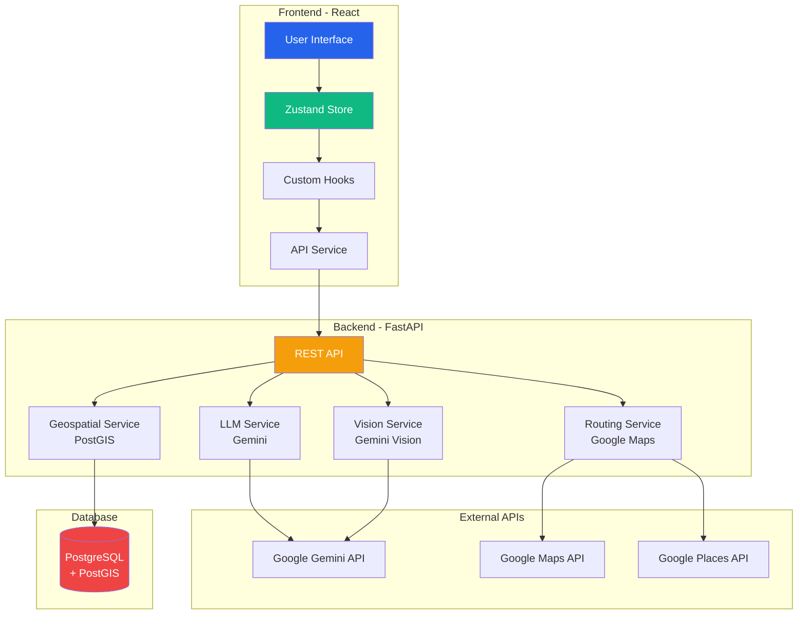
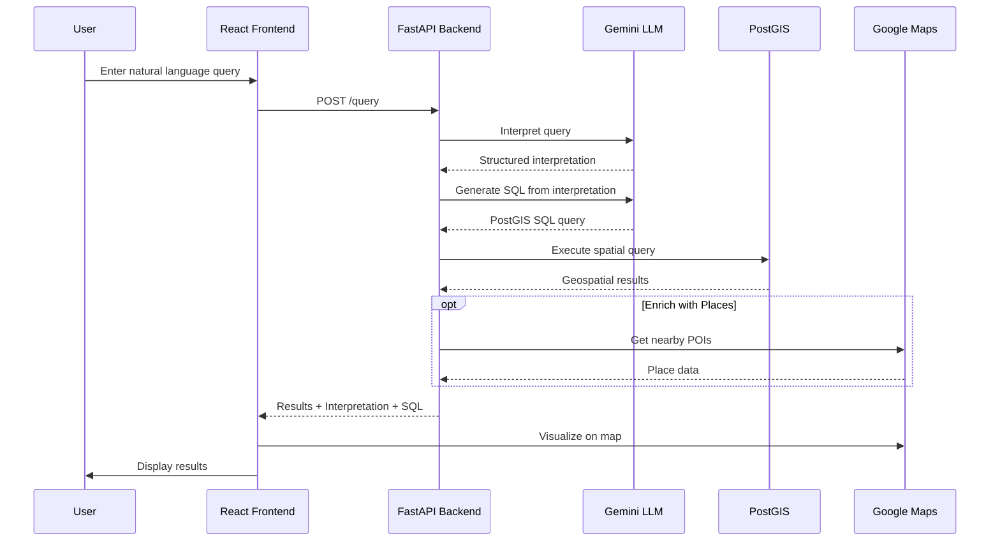
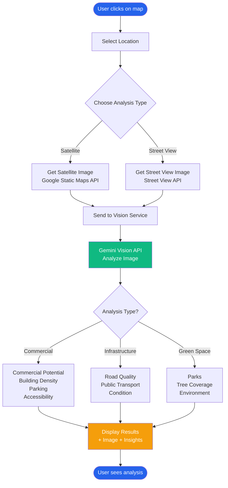
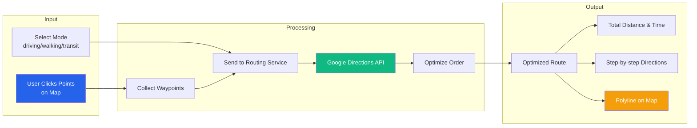
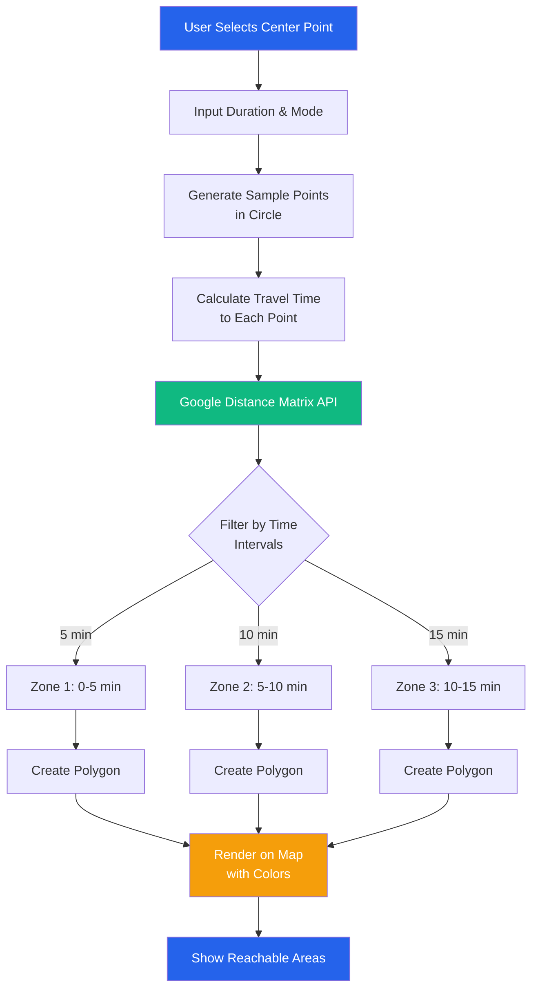
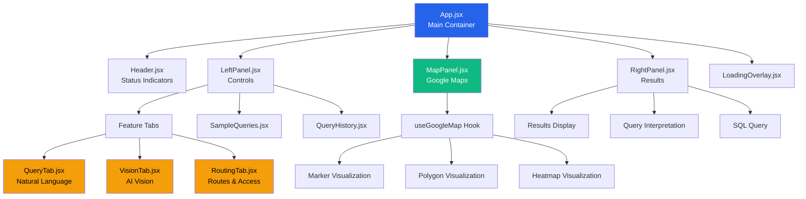
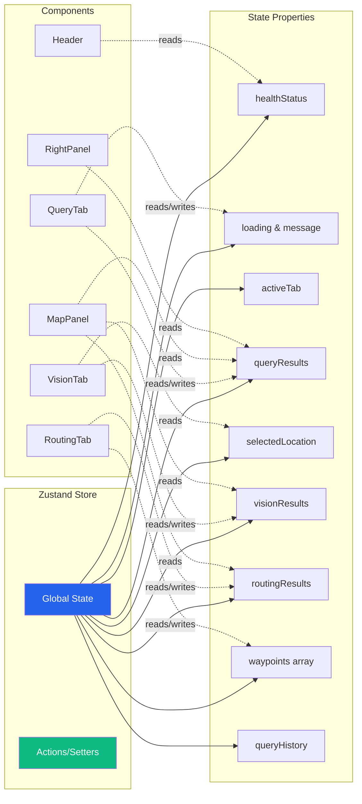
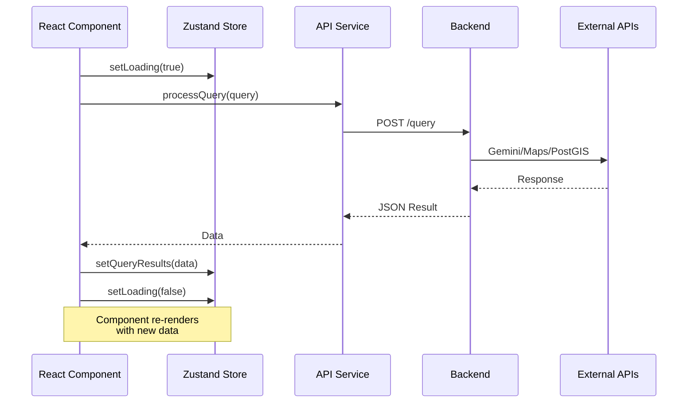
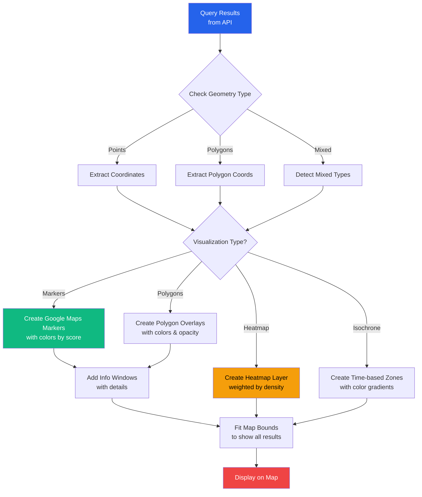

# 🗺️ GeoMindIA - React Frontend

Modern React frontend for **GeoMindIA** with multi-modal AI vision, route optimization, and natural language geospatial queries.

*Intelligent geospatial analysis powered by AI*

## ✨ Features

- **Natural Language Queries** - Ask questions about geospatial data in plain English
- **AI Vision Analysis** - Analyze satellite and street view imagery with Gemini
- **Route Optimization** - Optimize multi-point routes and calculate isochrone maps
- **Accessibility Analysis** - Evaluate location accessibility to amenities
- **Real-time Visualization** - Dynamic map rendering with multiple visualization types
- **Modern React** - Built with React 18, Vite, and Zustand for state management

## 🚀 Quick Start

### Prerequisites

- Node.js 18+ and npm
- Backend API running on http://localhost:8000
- Google Maps API key

### Installation

```bash
# Navigate to the React frontend directory
cd frontend-react

# Install dependencies
npm install

# Copy environment file
cp .env.example .env

# Edit .env and add your Google Maps API key
# VITE_GOOGLE_MAPS_API_KEY=your_key_here
```

### Development

```bash
# Start development server
npm run dev

# Open browser to http://localhost:3000
```

### Build for Production

```bash
# Create optimized production build
npm run build

# Preview production build
npm run preview
```

## 📁 Project Structure

```
frontend-react/
├── src/
│   ├── components/          # React components
│   │   ├── Header.jsx       # App header with status
│   │   ├── LeftPanel.jsx    # Query/Vision/Routing tabs
│   │   ├── MapPanel.jsx     # Google Maps integration
│   │   ├── RightPanel.jsx   # Results display
│   │   ├── LoadingOverlay.jsx
│   │   ├── SampleQueries.jsx
│   │   ├── QueryHistory.jsx
│   │   └── tabs/
│   │       ├── QueryTab.jsx
│   │       ├── VisionTab.jsx
│   │       └── RoutingTab.jsx
│   ├── hooks/
│   │   └── useGoogleMap.js  # Custom hook for map
│   ├── services/
│   │   └── api.js           # API client
│   ├── store/
│   │   └── appStore.js      # Zustand state management
│   ├── App.jsx              # Main app component
│   ├── main.jsx             # App entry point
│   └── index.css            # Global styles
├── package.json
├── vite.config.js
└── index.html
```

## 🎯 Key Technologies

- **React 18** - Modern React with hooks
- **Vite** - Lightning-fast build tool
- **Zustand** - Lightweight state management
- **Axios** - HTTP client
- **Google Maps API** - Map visualization
- **CSS3** - Modern styling with CSS variables

## 🔧 Configuration

### Environment Variables

Create a `.env` file:

```env
VITE_API_URL=http://localhost:8000
VITE_GOOGLE_MAPS_API_KEY=your_google_maps_api_key
```

### API Proxy

Vite is configured to proxy `/api` requests to the backend:

```javascript
// vite.config.js
export default defineConfig({
  server: {
    proxy: {
      '/api': 'http://localhost:8000'
    }
  }
})
```

## 🎨 State Management

Using **Zustand** for simple and powerful state management:

```javascript
import { useAppStore } from './store/appStore'

function Component() {
  const { 
    queryResults, 
    setQueryResults,
    loading, 
    setLoading 
  } = useAppStore()
  
  // Use state...
}
```

## 🗺️ Map Integration

Custom hook for Google Maps:

```javascript
import { useGoogleMap } from './hooks/useGoogleMap'

function MapPanel() {
  const { map, visualizeResults, clearMap } = useGoogleMap(mapRef, options)
  
  // Use map...
}
```

## 📱 Features

### 1. Query Tab
- Natural language input
- AI-powered query interpretation
- SQL generation
- Results visualization

### 2. Vision Tab
- Satellite imagery analysis
- Street view analysis
- Multiple analysis types
- AI-powered insights

### 3. Routing Tab
- Isochrone maps
- Accessibility scoring
- Route optimization
- Multi-point routing

## 🎭 Component Architecture

### Smart vs Presentational

- **Smart Components**: Connected to Zustand store (tabs, panels)
- **Presentational Components**: Pure React components (buttons, cards)

### Hooks Pattern

- `useGoogleMap` - Google Maps initialization and control
- `useAppStore` - Global state management
- React built-in hooks (useState, useEffect, useCallback)

## 🚀 Performance

- **Lazy Loading** - Code splitting for faster initial load
- **Memoization** - React.memo and useCallback for optimization
- **Efficient Re-renders** - Zustand prevents unnecessary re-renders
- **Vite HMR** - Hot Module Replacement for instant updates

## 🎨 Styling

### CSS Architecture

- **CSS Variables** - Theming with custom properties
- **Component Scoped** - CSS modules for each component
- **Mobile First** - Responsive design
- **Modern CSS** - Flexbox, Grid, animations

### Theme Variables

```css
:root {
  --primary-color: #2563eb;
  --success-color: #10b981;
  --error-color: #ef4444;
  --bg-color: #f8fafc;
  /* ... */
}
```

## 🐛 Debugging

### Development Tools

```bash
# Start with source maps
npm run dev

# React DevTools
# Install browser extension

# Check build size
npm run build -- --report
```

## 📦 Deployment

### Static Hosting

```bash
# Build for production
npm run build

# Deploy dist/ folder to:
# - Vercel
# - Netlify
# - GitHub Pages
# - AWS S3
```

### Docker

```dockerfile
FROM node:18-alpine
WORKDIR /app
COPY package*.json ./
RUN npm ci
COPY . .
RUN npm run build
```

## 🔄 Migration from Vanilla JS

Benefits of React version:

✅ **Component Reusability** - DRY code
✅ **Type Safety** - Better with TypeScript
✅ **State Management** - Centralized with Zustand
✅ **Performance** - React optimization
✅ **Developer Experience** - Hot reload, better debugging
✅ **Ecosystem** - Huge library of components
✅ **Maintainability** - Easier to scale

## 🤝 Contributing

```bash
# Create feature branch
git checkout -b feature/new-feature

# Make changes

# Run linting
npm run lint

# Test build
npm run build

# Commit and push
```

## 📊 Architecture Diagrams

### System Architecture



### Natural Language Query Flow



### Vision Analysis Flow



### Route Optimization Flow



### Isochrone Calculation Flow



### React Component Hierarchy



### Zustand State Management



### API Request Flow



### Data Visualization Pipeline



## 📄 License

MIT License - feel free to use for learning and projects!

---


